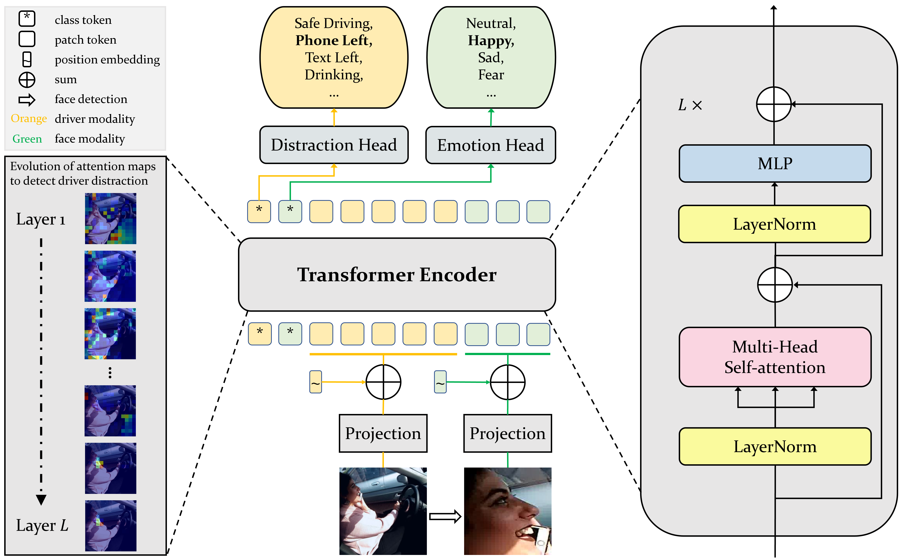

# ViT-DD: Multi-Task Vision Transformer for Semi-Supervised Driver Distraction Detection

### [paper](https://arxiv.org/abs/2209.09178)




## Abstract

Driver distraction detection is an important computer vision problem that can play a crucial role in enhancing traffic safety and reducing traffic accidents. This paper proposes a novel semi-supervised method for detecting driver distractions based on Vision Transformer (ViT). Specifically, a multi-modal Vision Transformer (ViT-DD) is developed that makes use of inductive information contained in training signals of distraction detection as well as driver emotion recognition. Further, a self-learning algorithm is designed to include driver data without emotion labels into the multi-task training of ViT-DD. Extensive experiments conducted on the SFDDD and AUCDD datasets demonstrate that the proposed ViT-DD outperforms the best state-of-the-art approaches for driver distraction detection by 6.5% and 0.9%, respectively. 

## Results

|                      Experiments                      | Accuracy |  NLL   |                                                            Checkpoints                                                            |
| :---------------------------------------------------: | :------: | :----: | :-------------------------------------------------------------------------------------------------------------------------------: |
|           [AUCDD](configs/vitdd_acudd.yaml)           |  0.9359  | 0.2399 |     [link](https://purdue0-my.sharepoint.com/:u:/g/personal/yunsheng_purdue_edu/EbRPfyR5QWpNjrF5jbuY5y0BXfBk4FRr0mNSYLKDMqIYYw?e=FhP7fB)      |
| [SFDDD split-by-driver](configs/vitdd_sfddd_sbd.yaml) |  0.9251  | 0.3900 | [link](https://purdue0-my.sharepoint.com/:u:/g/personal/yunsheng_purdue_edu/EVxQRFho80VBl_WtP4XKcTUBpMdMDczu-EmlNSN-lXm86Q?e=gNYfxD) |
| [SFDDD split-by-image](configs/vitdd_sfddd_sbi.yaml)  |  0.9963  | 0.0171 | [link](https://purdue0-my.sharepoint.com/:u:/g/personal/yunsheng_purdue_edu/Ea8r8Nnz3B1MgIKGjnX09T4B78bgU1x2woEok_FGbsqVnQ?e=4zNQw0) |

## Usage

### Prerequisites

The code is built with following libraries:

- Python >= 3.8
- [PyTorch](https://pytorch.org/)
- [Lightning](https://www.pytorchlightning.ai/)
- [timm](https://github.com/rwightman/pytorch-image-models)
- [seaborn](https://seaborn.pydata.org/index.html)

### Data Preparation

Please organize the data using the directory structures listed below:

```
data_root
|-- AUCDD
    |-- v2
        |-- cam1
            |-- test
            |-- train
              |-- c0
              |-- ...
              |-- c9
                |-- 188.jpg
                |-- ...
|-- SFDDD 
    |-- imgs
        |-- train
          |-- c0
          |-- ...
          |-- c9
            |-- img_19.jpg
            |-- ...
```

```
pseudo_label_path
|-- AUCDD
  |-- emo_list.csv
  |-- imgs
      |-- c0
      |-- ...
      |-- c9
          |-- 0_face.jpg
          |-- ...
|-- SFDDD
  |-- emo_list.csv
  |-- imgs
      |-- img_5_face.jpg
      |-- ...

```

We provide our generated pseudo emotion labels as well as cropped images of drivers' faces for the AUCDD and SFDDD datasets [here](https://purdue0-my.sharepoint.com/:u:/g/personal/yunsheng_purdue_edu/EUpgT82VdpNEir_ck5lo4hEBBOPv8ymK6sze0fhMXMKsdw?e=1tMfhn).

## Citation

If you find ViT-DD beneficial or relevant to your research, please kindly recognize our efforts by citing our paper:

```bibtex
@article{Ma2022MultiTaskVT,
  title={Multi-Task Vision Transformer for Semi-Supervised Driver Distraction Detection},
  author={Yunsheng Ma and Ziran Wang},
  journal={arXiv},
  year={2022}
}
```
